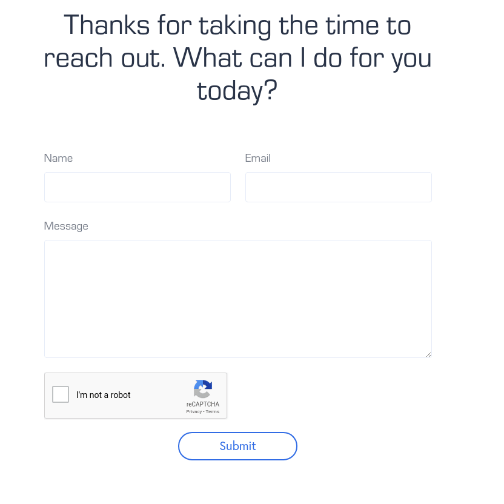

# Serverless Email Contact Form
Send contact form emails using Serverless with AWS Lambda and AWS SES

## Prerequisites
You will need:

* An AWS account
* An IAM account with privileges to send emails using SES
* An email address that's been [verified in SES](http://docs.aws.amazon.com/ses/latest/DeveloperGuide/verify-email-addresses.html). This is the email you'll be sending your emails to
* The [AWS CLI](https://aws.amazon.com/cli/) installed on your local machine, configured to your IAM credentials
* [serverless](https://serverless.com/) installed on your local machine

## Installation
1. Clone this repository to your local machine, and change to that directory
2. Change the values in `handler.js` in the `ses.sendEmail()` function, set the **ToAddresses** and **Source** to the email you've verified in SES. You can have multiple **ToAddresses**, as long as they're all verified in SES
3. You can test the function locally by running `serverless invoke local --function sendForm  --path event.json`. This will run the function using the data in `event.json`
4. Run `serverless deploy` to upload to AWS Lambda
5. You can test the function through Lambda by running `serverless invoke --function sendForm  --path event.json`. This will run the function using the data in `event.json`
6. A very basic contact form is included in the repository, `index.html`, replace `API_GATEWAY_URL` with the gateway URL that serverless displays in the console after you've deployed it. You can use this to test that the form works from a webpage. Uncomment the `redirectUrl` field if you want to redirect to another URL after a successful form submission.
7. You should be able to see the results of each form submission in **AWS CloudWatch > Log Groups > /aws/lambda/contact-form-prod-sendForm** (when you're in the AWS Console, make sure you're in the same region that you set in serverless.yml, otherwise the logs may not show up in CloudWatch)
